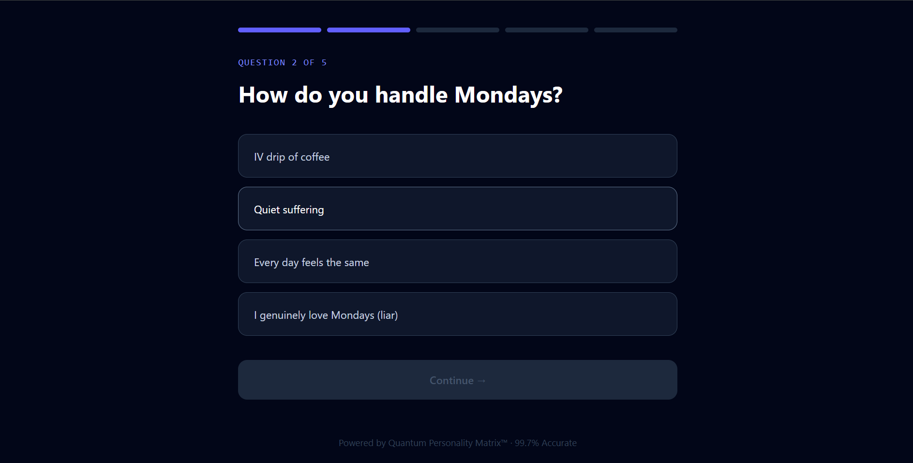
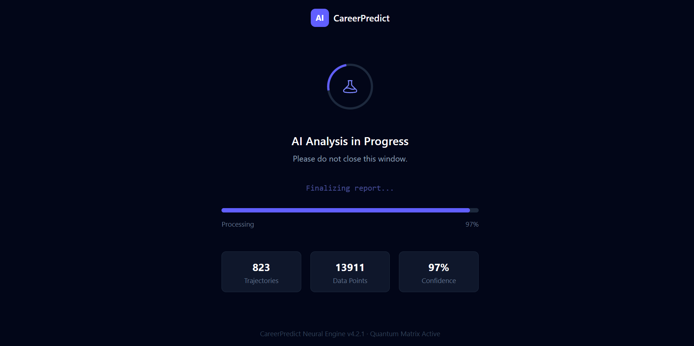
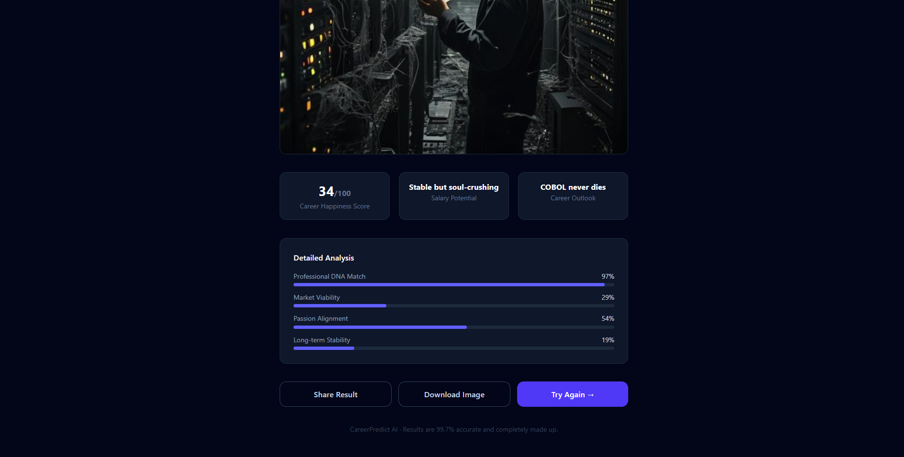

# CareerPredict AI

> *Results are 99.7% accurate and completely made up.*

**CareerPredict AI** analyzes your professional DNA across 847 career trajectories using our proprietary Quantum Personality Matrix™ — then tells you you're destined to be a *JIRA Ticket Archaeologist, Legacy Systems Division.*

It takes 2 minutes. Results are permanent. Used by 50,000+ professionals worldwide.

**[→ Discover Your Career Destiny](https://career-predictor-cnvg.onrender.com)**

---

## Screenshots

<table>
  <tr>
    <td></td>
    <td></td>
  </tr>
  <tr>
    <td align="center"><em>Discover Your True Career Destiny™</em></td>
    <td align="center"><em>The questions are hard. The answers are harder.</em></td>
  </tr>
  <tr>
    <td></td>
    <td></td>
  </tr>
  <tr>
    <td align="center"><em>823 trajectories. 13,911 data points. Please do not close this window.</em></td>
    <td align="center"><em>COBOL never dies. Neither does your destiny.</em></td>
  </tr>
  <tr>
    <td colspan="2"></td>
  </tr>
  <tr>
    <td colspan="2" align="center"><em>34/100 happiness score. Salary potential: Stable but soul-crushing.</em></td>
  </tr>
</table>

---

## How It Works

1. **Sign in with Google** — your data is safe (we just save your result)
2. **Answer 5 questions** — covering your strengths, your Mondays, and your general relationship with suffering
3. **Watch the analysis** — 97% confidence, 100% fabricated metrics, maximum suspense
4. **Receive your destiny** — one of 100+ hilariously niche careers, a happiness score, and an AI-generated portrait of your future self
5. **Share the verdict** — via native share, clipboard, or image download

Sample results include:
- *Founder Waiting for Series A That Will Never Come*
- *JIRA Ticket Archaeologist, Legacy Systems Division*
- *Professional LinkedIn Thought Leader (No One Reads)*
- *Chief Vibes Officer at Startup with 6 Months of Runway*

---

## Features

- **Google OAuth** — one click, no passwords, no excuses
- **5-question personality quiz** — Quantum Personality Matrix™ certified
- **Fake AI loading screen** — 823 trajectories analyzed in real time (not really)
- **AI-generated portrait** via [Pollinations.ai](https://pollinations.ai) — free, no API key required
- **Career stats** — happiness score, salary potential, career outlook, detailed DNA match breakdown
- **Shareable results** — native share API, clipboard copy, and image download

---

## Tech Stack

| Layer | Tech |
|-------|------|
| Frontend | React 19 · Vite 6 · Tailwind CSS 4 · React Router 7 |
| Backend | Node.js · Express 4 · Passport.js |
| Database | SQLite (sql.js) |
| Auth | Google OAuth 2.0 |
| Image gen | Pollinations.ai (free, no key) |
| Hosting | Render |

---

## Local Setup

### Prerequisites

- Node.js 20+
- A Google Cloud project with OAuth 2.0 credentials

### 1. Clone

```bash
git clone https://github.com/Royc4515/career-predictor.git
cd career-predictor
```

### 2. Configure environment

Create `server/.env`:

```env
GOOGLE_CLIENT_ID=your_client_id
GOOGLE_CLIENT_SECRET=your_client_secret
GOOGLE_CALLBACK_URL=http://localhost:5000/auth/google/callback
SESSION_SECRET=anything_long_and_random
CLIENT_URL=http://localhost:3000
NODE_ENV=development
```

In Google Cloud Console → **Authorized redirect URIs**, add:
```
http://localhost:5000/auth/google/callback
```

### 3. Install & run

```bash
npm install
cd client && npm install && cd ..
npm run dev
```

Frontend → [http://localhost:3000](http://localhost:3000)  
Backend → [http://localhost:5000](http://localhost:5000)

---

## Deployment (Render)

The app runs as a single Render service. Express builds the React frontend and serves it as static files.

### Environment variables

| Variable | Value |
|----------|-------|
| `GOOGLE_CLIENT_ID` | from Google Cloud Console |
| `GOOGLE_CLIENT_SECRET` | from Google Cloud Console |
| `GOOGLE_CALLBACK_URL` | `https://your-app.onrender.com/auth/google/callback` |
| `SESSION_SECRET` | any long random string |
| `CLIENT_URL` | `https://your-app.onrender.com` |
| `NODE_ENV` | `production` |

### Google Cloud Console

Add your Render URL under:
- **Authorized JavaScript origins** → `https://your-app.onrender.com`
- **Authorized redirect URIs** → `https://your-app.onrender.com/auth/google/callback`

---

## Project Structure

```
career-predictor/
├── client/               # React frontend (Vite)
│   └── src/
│       ├── pages/        # Landing, Quiz, Loading, Result
│       └── components/
├── server/               # Express backend
│   ├── routes/
│   │   ├── authRoutes.js
│   │   └── userRoutes.js
│   └── index.js
└── screenshots/          # README assets
```

---

## API

| Method | Endpoint | Description |
|--------|----------|-------------|
| `GET` | `/auth/google` | Start Google OAuth flow |
| `GET` | `/auth/google/callback` | OAuth callback |
| `GET` | `/auth/me` | Get current user session |
| `GET` | `/auth/logout` | Log out |
| `POST` | `/api/user/onboarding` | Save quiz answers + result |
| `GET` | `/api/user/result` | Fetch saved result |
| `GET` | `/api/health` | Health check |

---

## Contributing

Have a funnier career title? Found a bug in our Quantum Personality Matrix™? PRs are welcome.

```bash
git checkout -b feat/funnier-careers
git commit -m "feat: add 'Chief Remote Work Evangelist (Has Never Met Teammates)'"
git push origin feat/funnier-careers
```

Open a PR. Results are permanent.

---

## License

MIT — use it freely, but please don't use it for actual career counseling.

---

*CareerPredict Neural Engine v4.2.1 · Quantum Matrix Active*
